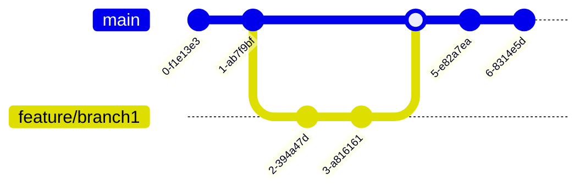

# Contributor's guide

Before you start, consider taking a look at the [documentation](https://lector.pages.dev/docs). It will give you a good understanding of the project and can help you understand the context of your contributions.

## How to contribute

This project encourages contributions from the community. You can contribute in the following areas:

- **Feedback**: Help make the project better by sharing your ideas. Start a conversation by opening a [feedback discussion](https://github.com/lectorjs/lector/discussions). Once discussed and accepted, an issue will be created, allowing you to work on it or leave it for others to work on.
- **Documentation**: Help improve the project’s documentation. Small changes like fixing typos or broken links can be submitted directly as a PR. For bigger changes, start a conversation by opening a [feedback discussion](https://github.com/lectorjs/lector/discussions).
- **Bug discovery**: Help improve the project’s stability by identifying and reporting bugs. Before flagging an issue, [ensure it hasn't already been addressed](https://github.com/lectorjs/lector/issues). If no one else has reported it, you can either fix it yourself or leave it for others to fix.

## Contribution workflow

1. **Open an issue**: Users start new issues for various reasons such as reporting bugs or proposing changes.
2. **Review and labeling**: The maintainers review the new issues and label them as follows:
   - `duplicate`: Issues that duplicate another and require consolidation.
   - `blocked`: Issues impeded by dependencies or external factors.
   - `needs owner`: Issues ready for work, awaiting volunteer contribution.
   - `needs refinement`: Issues lacking necessary information or clarity.
   - `wontfix`: Issues falling outside the project's scope and not planned for resolution.
   - `BREAKING`: Issues that introduce significant alterations to the project's codebase or functionality, potentially breaking backward compatibility or requiring substantial reworking of existing implementations.
3. **Volunteer**: You or other volunteers can express interest in resolving issues by offering solutions or volunteering for ownership.
4. **Assignment**: The maintainers assign issues to volunteers, making them the issue’s "owner".
5. **Pull request submission**: The issue owner submits a pull request with the proposed changes to resolve the issue.
6. **Review and merge**: The maintainers review the pull request, provide feedback if necessary, and merge it into the main repository upon approval.

## Good first issues

If you’re new to the codebase, consider starting with issues labeled as [good first issue](https://github.com/lectorjs/lector/issues?q=is%3Aissue+is%3Aopen+label%3A%22good+first+issue%22+-label%3A%22blocked+by+upstream%22). These issues are relatively straightforward to work on. Before you start, make sure there’s no existing PR for the issue and that it hasn’t been assigned to anyone yet. Once you’ve found an issue you’d like to work on, notify the maintainers by commenting on the issue. This ensures proper coordination and prevents overlapping.

## Coding style

This project uses the following tools to maintain consistent coding styles:

1. [golangci](https://github.com/golangci/golangci-lint) for linting of Go code.
2. [Biome](https://biomejs.dev/) for linting and formatting of the UI project. The configuration can be found in [biome.json](ui/biome.json).
3. [EditorConfig](https://editorconfig.org/) for maintaining consistent coding styles across various editors and IDEs. The configuration can be found in [.editorconfig](.editorconfig).

## Git workflow

The git branching model used in this project aligns with [trunk-based development](https://trunkbaseddevelopment.com/).

1. **Development**: Developers work on temporary branches to add new features or fix errors. Changes should be frequently integrated with the main branch (`master`) to minimize merge conflicts.
2. **Code review**: Once changes are complete, a pull request should be created to merge the temporary branch with `master`. The PR should be reviewed and approved by at least one maintainer before merging.
3. **Merge and release**: The pull request is merged into `master`, triggering an automatic release workflow.

## License

By contributing to this project, you agree to license your contributions under the project’s [license](LICENSE).
